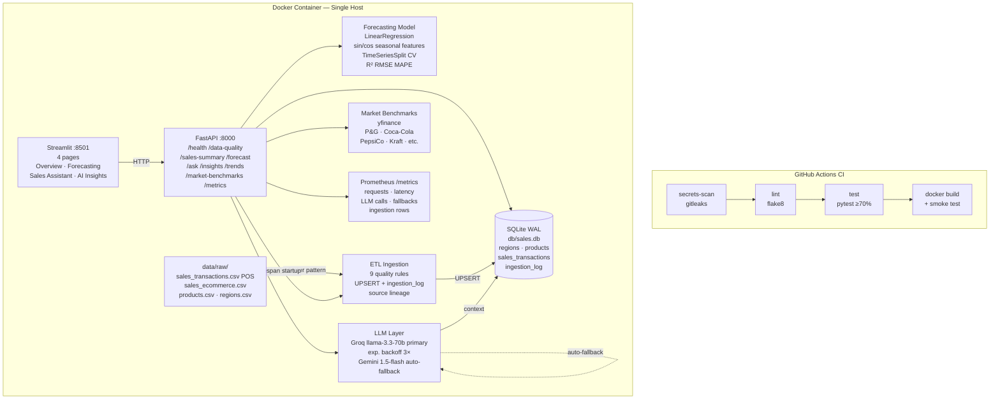

# CPG Sales Intelligence — Repository Submission Review

**Assessment:** AI Acceleration Engineer  
**Candidate:** Shubham  
**Repository:** https://github.com/pdshubham98/cpg-sales-intelligence  
**Version:** 3.1.0  
**Date:** 2026-06-20

---

## Project Overview

### Problem Statement

CPG sales teams operate with fragmented data across multiple channels — POS terminals and e-commerce platforms — with inconsistent schemas, currencies, and date formats. Analysts lack a unified view of revenue performance, cannot generate reliable short-term forecasts, and must manually synthesize insights from raw spreadsheets. There is no natural language interface for ad-hoc business questions.

### Solution Overview

CPG Sales Intelligence is an end-to-end AI analytics platform that ingests multi-source sales data, validates quality, stores clean data in SQLite, and exposes it through a FastAPI backend and a Streamlit dashboard. An LLM layer (Groq Llama 3.3 70B primary, Gemini 1.5 Flash fallback) provides natural language Q&A, trend summaries, and actionable business insights. Revenue forecasting uses linear regression with cyclical seasonal encoding validated with time-series cross-validation.

### Key Capabilities

- **Multi-source ETL** — POS (YYYY-MM-DD, USD) + E-Commerce (MM/DD/YYYY, EUR) with adapter pattern; idempotent UPSERT; `ingestion_log` audit table
- **9 data quality rules** — duplicate IDs, null IDs, non-positive quantities/prices, unparseable dates, mixed-case SKU normalisation; per-rule drop counts reported
- **Revenue forecasting** — LinearRegression with sin/cos seasonal features; TimeSeriesSplit CV; R², RMSE, and MAPE reported per dimension
- **LLM Q&A** — natural language Q&A, trend summaries, and actionable insights; multi-turn chat; live competitor benchmarks (Yahoo Finance) in context
- **4-page Streamlit dashboard** — date range filter, MoM delta KPI cards, CSV export on every chart, multi-session chat interface
- **8 REST endpoints** — optional bearer-token auth, Prometheus `/metrics`, structured error responses
- **Single Docker container** — both services; named volume; healthcheck; 4-stage CI/CD (secrets scan → lint → test ≥70% → Docker smoke test)

---

## Architecture Overview

### Mermaid Diagram

### Components

| Component | Technology | File(s) | Responsibility |
|---|---|---|---|
| UI | Streamlit + Plotly | `ui/app.py` | 4-page dashboard; date filter; MoM KPIs; multi-session chat; CSV export |
| API | FastAPI + Uvicorn | `src/api/main.py`, `src/api/routes/` | 8 REST endpoints; HTTP middleware for metrics; lifespan ingestion |
| Auth | FastAPI Depends | `src/api/auth.py` | Optional `X-Api-Key` bearer token; disabled when `SECRET_KEY` unset |
| Observability | prometheus-client | `src/api/metrics.py`, `routes/metrics_route.py` | Request count/latency; LLM latency/errors/fallbacks; ingestion row gauges |
| ETL | Pandas, adapter pattern | `src/ingestion/loader.py` | Multi-source load; 9 quality rules; EUR→USD; UPSERT; late-arriving detection |
| Schema | SQLite WAL | `src/ingestion/schema.py` | DDL; `get_connection()`; migration guard for `source` column |
| Forecasting | scikit-learn | `src/forecasting/model.py` | LinearRegression; sin/cos seasonal features; TimeSeriesSplit CV; R², RMSE, MAPE |
| LLM | Groq + Gemini | `src/insights/llm.py` | Provider routing; exponential backoff; auto-fallback; Q&A; trends; insights |
| Market Data | yfinance | `src/market/benchmarks.py` | Quarterly revenue for 6 CPG majors; no API key required |

### Data Flow

1. **Container start** → FastAPI `lifespan` triggers `run_ingestion()`
2. **Ingestion** reads `data/raw/*.csv` through source adapters; applies 9 quality rules; UPSERTs clean rows to SQLite; writes run summary to `ingestion_log`
3. **API queries** — routes read SQLite for aggregated analytics; pass context to forecasting engine or LLM layer
4. **LLM flow** — sales summary + live market benchmarks serialised as JSON; sent to Groq with exponential backoff (1 s / 2 s / 4 s); auto-falls back to Gemini if all retries fail and `GEMINI_API_KEY` is set
5. **UI flow** — Streamlit calls FastAPI over HTTP; renders Plotly charts and chat interface in browser
6. **Metrics** — every HTTP request updates Prometheus counters/histograms; `/metrics` exposes them in Prometheus text format

---

## Technology Stack

| Layer | Technology | Version | Decision Rationale |
|---|---|---|---|
| Frontend | Streamlit + Plotly | 1.41.1 / 5.24.1 | No build step; no Node.js; Plotly charts are production-quality. See ADR-001 §7 |
| Backend | FastAPI + Uvicorn | 0.115.5 / 0.32.1 | Auto OpenAPI docs; Pydantic validation; lifespan hooks. See ADR-001 §2 |
| Data Validation | Pydantic | 2.10.3 | Schema enforcement on all request/response models; `datetime.date` type prevents SQL injection |
| Data Layer | SQLite (WAL mode) | stdlib | Zero-ops; file-based; concurrent reads; FK constraints. See ADR-001 §3 |
| ETL | Pandas | 2.2.3 | Sufficient for ~250 rows; PySpark drop-in for production scale. See ADR-001 §4 |
| ML | scikit-learn + NumPy | 1.5.2 / 1.26.4 | LinearRegression + TimeSeriesSplit; no GPU; interpretable; fast |
| AI Primary | Groq `llama-3.3-70b-versatile` | groq 0.13.1 | Free tier; no credit card; 14,400 req/day; state-of-art 70B quality. See ADR-001 §5 |
| AI Fallback | Gemini `gemini-1.5-flash` | google-genai 1.16.0 | Free 1M tokens/day; auto-triggered on Groq exhaustion |
| Market Data | yfinance | 0.2.54 | No API key; live quarterly financials for 6 CPG majors |
| Observability | prometheus-client | 0.21.1 | Standard pull-model metrics; `/metrics` endpoint; zero external dependency |
| Container | Docker + docker-compose | — | Single container; named volume for DB persistence; `restart: unless-stopped` |
| CI/CD | GitHub Actions | — | Native to repo; 4-stage pipeline; coverage artifact upload |
| Security | gitleaks-action@v2 | — | Full git history secrets scan; blocks all downstream jobs |
| Testing | pytest + pytest-cov | 8.4.2 / 7.1.0 | 69 tests; all mocked; ≥70% coverage gate |
| Linting | flake8 | 7.1.1 | PEP 8; max-line 100; E203/W503 ignored |

---

## Requirement Traceability Matrix

| Requirement | Implementation | File : Line |
|---|---|---|
| Ingest structured sales data | Reads POS and E-Commerce CSVs via source adapter registry | `src/ingestion/loader.py:79-82` |
| Multi-source with schema drift | `_adapt_pos()` and `_adapt_ecommerce()` map different column names, dates, currency | `loader.py:52-75` |
| EUR→USD currency conversion | `pd.to_numeric * _EUR_TO_USD` in e-commerce adapter | `loader.py:73` |
| Date format normalisation | `_normalize_dates()` accepts YYYY-MM-DD and MM/DD/YYYY | `loader.py:94-98` |
| 9 data quality rules | Rules 1–8 (dup IDs, nulls, non-positive values, bad dates, mixed-case SKU) + late-arriving | `loader.py:140-201` |
| Late-arriving record detection | Records >60 days before batch max date flagged in summary | `loader.py:193-201` |
| Data source lineage | `source` column on `sales_transactions`; set from `_source` adapter field | `loader.py:223`, `schema.py:46` |
| Idempotent ingestion (UPSERT) | `INSERT OR REPLACE` via custom `_upsert()` keyed on `transaction_id` | `loader.py:225-229` |
| Ingestion audit log | `ingestion_log` table; raw/clean/dropped counts + per-source JSON | `schema.py:53-62`, `loader.py:243-247` |
| Schema migration safety | `PRAGMA table_info()` guard before `ALTER TABLE ADD COLUMN source` | `schema.py:64-66` |
| Revenue forecasting | LinearRegression on monthly aggregates by region, category, or product | `src/forecasting/model.py:171` |
| Cyclical seasonal features | `sin(2π·month/12)` and `cos(2π·month/12)` prevent year-boundary discontinuity | `model.py:86-87` |
| Time-series cross-validation | `TimeSeriesSplit` enforces chronological fold ordering (no data leakage) | `model.py:127` |
| R², RMSE, MAPE metrics | All three computed per-fold and averaged; included in `ForecastResult` | `model.py:129-146` |
| LLM natural language Q&A | `ask_question()` with optional multi-turn `history` parameter | `src/insights/llm.py:154` |
| LLM trend summary | `summarize_trends()` produces 3–5 sentence plain-English analysis | `llm.py:139` |
| 5 actionable AI insights | `generate_insights()` parses numbered list; strips leading numbering | `llm.py:188-211` |
| LLM exponential backoff | 3 attempts; 1 s / 2 s / 4 s delays; auth errors bail immediately | `llm.py:91-117` |
| Auto Groq→Gemini fallback | On Groq exhaustion, auto-calls Gemini if `GEMINI_API_KEY` set | `llm.py:66-78` |
| Live market benchmarks | yfinance; 6 CPG tickers; injected into LLM context as `industry_benchmarks` | `src/market/benchmarks.py`, `routes/ask.py:44-58` |
| `/health` endpoint | Status + DB row counts + `last_ingestion` from `ingestion_log` | `src/api/routes/health.py` |
| `/sales-summary` with date filter | Aggregated KPIs; `start_date`/`end_date` typed as `datetime.date` | `src/api/routes/summary.py` |
| `/forecast` endpoint | Pydantic-validated request; `periods` clamped 1–12; 404 on no data | `src/api/routes/forecast.py` |
| `/ask` multi-turn chat | Accepts `history` list; last 6 turns included in prompt | `routes/ask.py:92-114` |
| `/insights` endpoint | 5 actionable insights as JSON list | `routes/ask.py:117-133` |
| `/trends` endpoint | LLM trend summary as JSON | `routes/ask.py:136-152` |
| `/market-benchmarks` endpoint | Live quarterly revenue for P&G, Coca-Cola, PepsiCo, Kraft, General Mills, Unilever | `src/api/routes/market.py` |
| `/metrics` Prometheus endpoint | Text format; `CONTENT_TYPE_LATEST` content-type header | `src/api/routes/metrics_route.py` |
| Input validation — question length | `Field(max_length=2000)` on `AskRequest.question` | `routes/ask.py:75` |
| Input validation — periods range | `ge=1, le=12` on `ForecastRequest.periods` | `routes/forecast.py:23-26` |
| Structured 500 error responses | `"Internal server error"` + `logger.exception()` on all routes | All route files |
| Optional API key auth | `X-Api-Key` header; disabled when `SECRET_KEY` env var unset | `src/api/auth.py` |
| Prometheus HTTP metrics | Request count and latency middleware on all routes | `src/api/main.py:39-51` |
| Prometheus LLM metrics | Latency histogram, error counter, fallback counter per provider | `src/api/metrics.py`, `llm.py:100-101` |
| 4-page Streamlit dashboard | Overview, Forecasting, Sales Assistant, AI Insights | `ui/app.py` |
| Date range filter on Overview | `start_date`/`end_date` pickers; forwarded to API as query params | `ui/app.py` |
| MoM delta KPI cards | `mom_delta` field from `/sales-summary`; colour-coded badge | `ui/app.py`, `routes/summary.py:126-150` |
| CSV export on every chart | `_csv_btn()` helper; `st.download_button` with `text/csv` | `ui/app.py` |
| Multi-session chat UI | Session dict in Streamlit session state; sidebar list; delete per session | `ui/app.py` |
| Docker deployment | `Dockerfile` + `docker-compose.yml`; single container; both ports | `Dockerfile`, `docker-compose.yml` |
| Container healthcheck | Polls `/health` via `python urllib` every 30 s | `docker-compose.yml:17-22` |
| 4-stage CI pipeline | secrets-scan → lint → test → docker build + smoke test | `.github/workflows/ci.yml` |
| Coverage gate ≥70% | `--cov-fail-under=70` in CI pytest command | `ci.yml:71` |
| Secrets scanning | `gitleaks-action@v2` on full git history; blocks downstream jobs | `ci.yml:9-21` |
| 69 automated tests | All mocked; per-function temp DB; `raise_server_exceptions=True` | `tests/` |
| Architecture decision records | 8 decisions with alternatives, rationale, and consequences | `docs/adr/ADR-001.md` |

---

## Production Readiness Summary

### Docker

Single container runs both FastAPI (:8000) and Streamlit (:8501) via `docker-entrypoint.sh`. Streamlit starts in background; Uvicorn foreground process keeps the container alive. Named Docker volume (`db_data`) persists the SQLite database across container restarts. `restart: unless-stopped` in `docker-compose.yml`. Healthcheck polls `/health` via Python urllib (no curl dependency) every 30 seconds with a 15-second start period and 3 retries.

### CI/CD

Four sequential stages on every push and pull request:

1. **secrets-scan** — `gitleaks-action@v2` scans the full git history (`fetch-depth: 0`); blocks all downstream jobs if secrets found
2. **lint** — `flake8` with `max-line-length=100`; `E203`/`W503` ignored; runs only after secrets-scan passes
3. **test** — `pytest` with `--cov=src --cov-fail-under=70`; XML coverage report uploaded as GitHub Actions artifact
4. **docker-build** — full image build + live smoke test against `/health` returning HTTP 200; runs on `main` branch only

### Testing

69 tests across 4 modules (`test_api.py`, `test_ingestion.py`, `test_insights.py`, `test_forecasting.py`). All LLM calls mocked — no API key required in CI. Tests use isolated per-function temp SQLite files via `tmp_path` fixture. `raise_server_exceptions=True` ensures server errors surface immediately rather than being swallowed. Key coverage areas:

- **Ingestion**: 9 quality rules individually; multi-source merging; EUR→USD conversion; date normalisation; cross-source deduplication; late-arriving detection; UPSERT idempotency; `ingestion_log` writes
- **Forecasting**: region/category/product dimensions; period clamping; R² type; seasonal feature math; edge cases (unknown dimension, insufficient data)
- **API**: all 8 endpoints; 400/404/422/503 error paths; Prometheus metrics content and content-type
- **LLM**: provider routing; auto-fallback; no-Gemini-key behaviour; prompt content assertions

### Documentation

| Document | Location | Content |
|---|---|---|
| README | `README.md` | Quickstart (local + Docker); full API reference; auth; observability; incremental ingestion; LLM routing |
| Architecture | `docs/architecture.md` | Mermaid diagram; component table; data flow; extension points |
| ADR | `docs/adr/ADR-001.md` | 8 technology decisions with alternatives, rationale, and consequences |
| Video Script | `docs/VIDEO_DEMO_SCRIPT.md` | Full 8-minute narration script with timestamps |
| Submission | `docs/SUBMISSION.md` | This document — overview, architecture, stack, traceability, readiness |
| Changelog | `CHANGELOG.md` | Version history v2.0 → v3.1.0 |

### Extension Points

Every swap is one file and one environment variable:

| What to extend | Current | How |
|---|---|---|
| Add a new data source | 2 CSV adapters | Add entry to `_SOURCE_REGISTRY` in `loader.py` with a new adapter function |
| Scale data processing | Pandas | Replace `loader.py` with PySpark; same quality rules, distributed execution |
| Scale storage | SQLite | Replace `get_connection()` in `schema.py` with `psycopg2`; schema is compatible |
| Swap LLM provider | Groq / Gemini | Add case to `_call_llm()` in `llm.py`; change `LLM_PROVIDER` env var |
| Upgrade forecasting model | LinearRegression | Replace `model.py` with Prophet or XGBoost; same `ForecastResult` interface |
| Live FX rates | Fixed `_EUR_TO_USD` constant | Replace constant with a live FX API call in `loader.py` |
| Metrics collection | Prometheus `/metrics` | Point any Prometheus scrape job at the endpoint; wire to Grafana |
| Deployment target | Docker single-host | Push image to ECR; deploy to ECS or Kubernetes |
