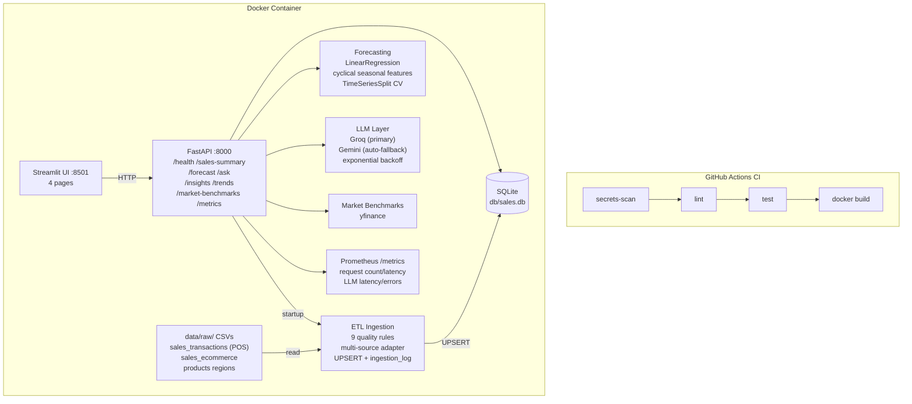

# Architecture

## System Overview

## Component Responsibilities

| Component | File(s) | Responsibility |
|---|---|---|
| ETL Ingestion | `src/ingestion/loader.py` | Multi-source adapter pattern; 9 quality rules; EUR→USD normalisation; late-arriving detection; UPSERT; ingestion_log |
| DB Schema | `src/ingestion/schema.py` | SQLite DDL, `get_connection()`, schema migration guards |
| Forecasting | `src/forecasting/model.py` | LinearRegression with cyclical seasonal features (sin/cos month); TimeSeriesSplit CV; R², RMSE, MAPE metrics |
| LLM Layer | `src/insights/llm.py` | Groq/Gemini routing; exponential backoff (3×); auto Groq→Gemini fallback; trend summary; Q&A; insights |
| Auth | `src/api/auth.py` | Optional `X-Api-Key` bearer token via `SECRET_KEY` env var; disabled when unset |
| Metrics | `src/api/metrics.py` + `routes/metrics_route.py` | Prometheus counters/histograms; `/metrics` endpoint |
| Market Data | `src/market/benchmarks.py` | Live quarterly revenue for major CPG companies via Yahoo Finance |
| FastAPI | `src/api/main.py` + `routes/` | REST API with 8 endpoints; HTTP middleware for request metrics |
| Streamlit UI | `ui/app.py` | 4-page dashboard: Overview, Forecasting, Sales Assistant, AI Insights |
| Tests | `tests/` | 69 pytest tests, all mocked |
| CI | `.github/workflows/ci.yml` | secrets-scan → lint → test (≥70% coverage) → Docker build |

## Data Flow

1. Container starts → FastAPI lifespan triggers `run_ingestion()`
2. Ingestion reads `data/raw/*.csv` through source adapters, applies 9 quality rules, UPSERTs clean data to SQLite, logs run to `ingestion_log`
3. FastAPI routes query SQLite for analytics and forecasting
4. LLM routes fetch aggregated context from SQLite, then call Groq (with retry) → Gemini (auto-fallback)
5. Streamlit calls FastAPI over HTTP, renders results in the browser
6. `/metrics` exposes Prometheus-compatible metrics scraped by any compatible collector

## Extension Points

| What to extend | Current | Next step |
|---|---|---|
| Add a new data source | Two CSV sources with adapter pattern | Add entry to `_SOURCE_REGISTRY` in `loader.py` with a new adapter function |
| Scale data processing | pandas | Replace `loader.py` with PySpark; same quality rules, distributed execution |
| Scale storage | SQLite | Replace `get_connection()` with PostgreSQL (`psycopg2`); schema is compatible |
| LLM provider | Groq / Gemini | Add case to `_call_llm()` in `llm.py`; one `LLM_PROVIDER` env var change |
| Forecasting model | LinearRegression + seasonal features | Replace `model.py` with Prophet or XGBoost; same interface |
| Currency conversion | Fixed EUR→USD rate in `loader.py` | Replace `_EUR_TO_USD` constant with a live FX API call |
| Market benchmarks | Yahoo Finance via yfinance | Swap `get_quarterly_revenue()` for any financial data provider |
| Metrics collection | Prometheus `/metrics` endpoint | Point a Prometheus scrape job at the endpoint; wire to Grafana for dashboards |
| Deployment | Docker single-host | Push image to ECR + deploy to ECS or Kubernetes |
